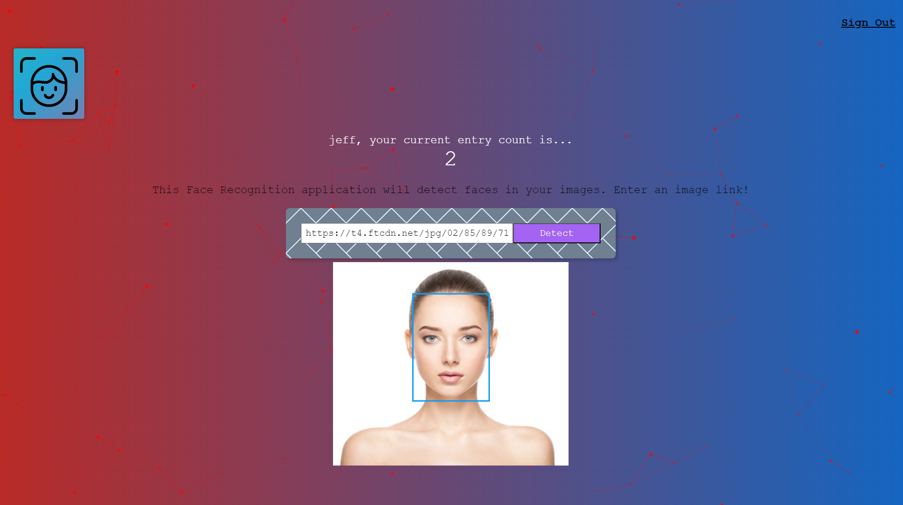
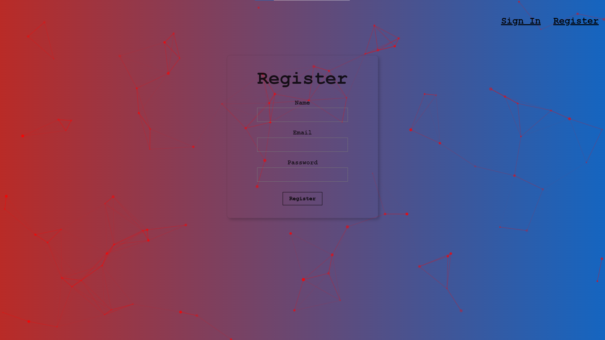

# Face Recognition App

This full-stack face recognition app allows users to detect faces in uploaded images using the Clarifai API. The project integrates a React-based front-end with a Node.js/Express.js back-end, along with a PostgreSQL database to store user information and image submission counts.

## Features:
- Face Detection: Users can input an image URL to detect faces using Clarifai’s machine learning API. 
- User Authentication: Secure user registration and login with hashed passwords (bcrypt). 
- User Ranking: Users can track how many images they have submitted for face detection.
- Responsive UI: Built with React and styled using Tachyons CSS

## Technologies Used:
- Front-end: React, JavaScript, Tachyons CSS, JSX
- Back-end: Node.js, Express.js, bcrypt
- Database: PostgreSQL with Knex.js for database querying
- Face Detection API: Clarifai API for image recognition
- Testing Tools: Postman for API testing

## Access the App:
You can try the live version of the app here:
[Face Recognition App](https://face-recognition-application-h7dk.onrender.com/)

 
 

